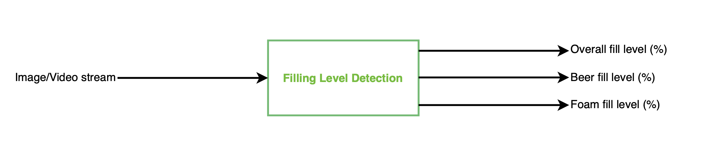
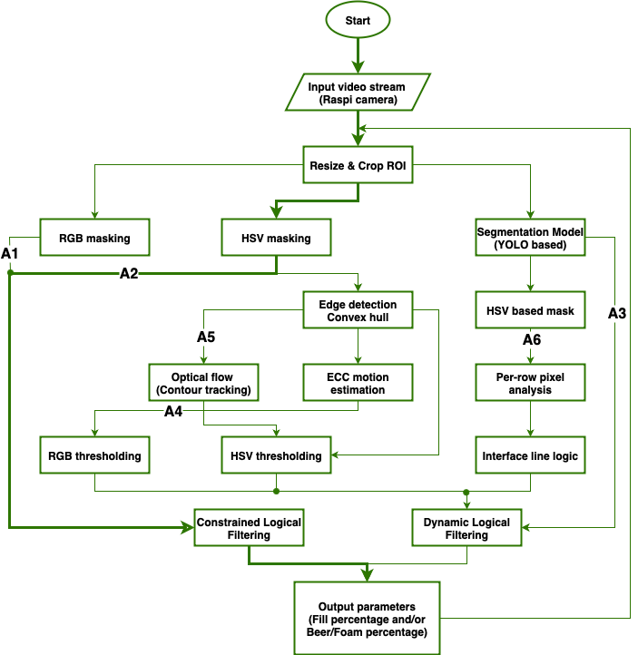
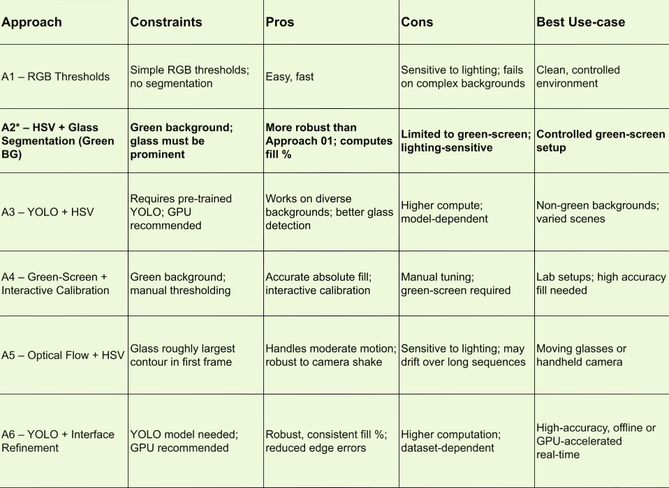
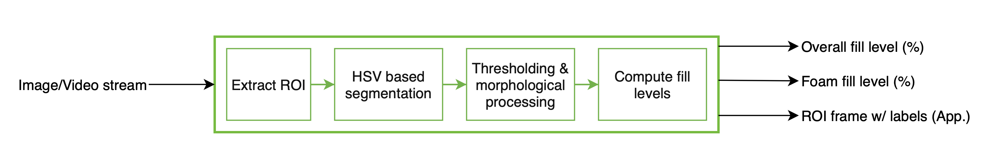

# wp2-fill-level

## Objectives

The goal of this subsystem is to **estimate the beer glass fill level** (beer + foam) from video streams.



## Background

Fill-level detection can be achieved using various techniques such as physical sensor-based and vision-based methods[^1][^2].
Some methods also employ artificial intelligence technologies[^3] to detect the fill percentage in transparent containers.
However, AI-based approaches require significant effort to collect large datasets for training ANN or CNN models capable of performing the task.
Popular models such as YOLO[^4] can also be applied, and many resources are available to support their implementation.
Since this project relies on the Raspberry Pi 4 Model B, computationally intensive methods cannot achieve the required frame rate.
To explore the potential of such resource-demanding methods, segmentation techniques have been included as part of the approaches to address the subsystem objective.


## Approaches

The following is the approaches explored:

1. **Approach 01 (A1)** – Threshold-based masking (RGB) for beer/foam.
2. **Approach 02 (A2)** – Glass segmentation and HSV thresholds with a green background.
3. **Approach 03 (A3)** – Deep learning segmentation (YOLO + masks) for robust inference.
4. **Approach 04 (A4)** – Green-Screen Removal + Interactive Beer/Foam Calibration
5. **Approach 05 (A5)** – Optical Flow + Beer/Foam HSV Segmentation
6. **Approach 06 (A6)** – YOLO + Robust Beer/Foam Mask Refinement


***

### Common Dependencies

Install the required dependencies which are used in the following approaches. Also please follow the installation steps in the [respective source](https://docs.ultralytics.com/quickstart/) for smooth installation if the following command didn't work as expected.

```bash
pip install opencv-python numpy ultralytics
```

## Approach 01 – Finding thresholds for beer/foam masks

### Assumptions

- The background is relatively uniform.
- Beer and foam colors are separable in HSV space.
- Glass contours are not explicitly segmented.

### Methodology

- Convert video frames[^6] to BGR.
- Define and apply fixed BGR ranges for beer and foam.
- Generate masks for both regions.
- Calculate fill level based relative pixel area.


### Usage

```bash
python opencv_RGB_tracker.py videos/beer_video.mp4
```

Tip: make the script executable before running it. Use can use the following command in the respective directory.
```bash
chmod +x *
```

### Offline Test

- Works on simple, clean backgrounds.
- Struggles with green reflections and complex scenes.
- Sensitive to lighting differences.


### Future Improvements

- Adaptive thresholding using histogram analysis.
- Morphological cleaning of masks.

***

## Approach 02 – Thresholds + Glass Segmentation in Green Background

### Assumptions

- Green background allows reliable glass segmentation.
- Beer + foam masks are extracted inside the detected glass contour.
- Fill percentage = (beer + foam area) / glass area.

### Methodology

- Convert frames to HSV.
- Detect and mask out the green background.
- Extract the largest contour (glass).
- Apply HSV thresholds for beer and foam inside the glass region.
- Compute fill percentage.


### Usage

```bash
 python opencv_green_masked.py videos/beer_narrow_glass_crop.mp4
```


### Offline Test

- Robust in controlled green-screen setups.
- Glass contour detection effective when glass is prominent.
- Still challenged by illumination changes or transparent overlaps.


### Future Improvements

- Improved contour-based glass tracking.
- Generalize glass segmentation beyond green backgrounds (motivation for Approach 03).

***

## Approach 03 – Segmentation Model (YOLO + Beer/Foam Masks)

### Assumptions

- Pre-trained segmentation model (`last-2.pt`) can detect glass boundaries.
- Beer and foam refined using HSV masks inside the segmented glass.
- Model inference generalizes better to diverse backgrounds.

### Methodology

- Load the YOLO segmentation model for glass detection.
- Run inference per video frame to extract the glass mask.
- Apply HSV-based beer/foam thresholds inside the mask.
- Refine beer/foam areas with contours and morphology.
- Compute fill %, foam %, and beer %.


### Usage

```bash
python opencv_segmentation_model.py videos/beer_normal_glass_crop.mp4
```


### Offline Test

- Robust performance on non-green backgrounds.
- Segmentation model improves glass extraction in challenge scenarios.
- Reasonably accurate beer/foam fill ratios.
- Requires GPU or optimized inference for real-time operation.


### Future Improvements

- End-to-end deep model predicting glass, beer, and foam (multi-class segmentation).
- Larger, fine-tuned datasets capturing lighting/foam variation.
- Temporal smoothing for consistent fill estimation in video.

***

## Approach 04 – Green-Screen Removal + Interactive Beer/Foam Calibration

### Assumptions

- Glass is placed against a green screen.
- Beer and foam colors can be interactively thresholded using RGB trackbars.
- Absolute fill levels are computed via calibration using empty and full references.

### Methodology

- Remove green background from the video using HSV-based masking.
- Track the glass contour using edge detection and convex hull approximation.
- Align frames via ECC motion estimation for stable tracking.
- Apply interactive RGB thresholds to segment beer and foam regions inside the glass.
- Clean masks using morphological operations and contour filtering.
- Compute top surfaces of beer and foam inside the glass.
- Calibrate absolute fill percentages using empty/full reference heights.
- Smooth values with a rolling average for stable fill estimates.


### Usage

```bash
python beer_fillper_opencv_callibration.py videos/beer1_cropped.mp4  
```


### Offline Test

- Accurate fill level estimation on green-screen setups.
- Allows fine-tuning for varying beer and foam colors using interactive trackbars.
- Calibration improves absolute fill percentage accuracy.


### Future Improvements

- Integrate with deep learning-based segmentation to remove green-screen dependency.
- Automatic threshold estimation without manual trackbars.

***

## Approach 05 – Optical Flow + Beer/Foam HSV Segmentation

### Assumptions

- Glass is visible and roughly the largest contour in the first frame.
- Moderate camera or glass motion can be handled by optical flow tracking.


### Methodology

- Read the first frame and detect the initial glass contour using edge detection.
- Track the glass contour frame-by-frame using optical flow (Lucas-Kanade method).
- Convert each frame to HSV.
- Segment beer (orange-yellow) and foam (white) using HSV thresholds inside the tracked glass contour.
- Remove small noisy blobs with contour filtering and morphological operations.


### Usage

```bash
python optical_flow_fillper.py videos/beer1_without_greenscreen.webm
```


### Offline Test

- Works with moving glasses or camera motion.
- Glass contour tracking is robust to moderate motion and slight illumination changes.
- Sensitive to lighting differences.


### Future Improvements

- Integrate more robust glass tracking (e.g., Kalman filter + optical flow).
- Adaptive HSV thresholds for varying lighting conditions.

***

## Approach 06 – YOLO + Robust Beer/Foam Mask Refinement

### Assumptions

- Pre-trained YOLO model (withblackbest.pt) detects glass boundaries.
- Interfaces are estimated using per-row pixel analysis to improve fill accuracy.

### Methodology

- Load the YOLO segmentation model for glass detection.
- Run inference per video frame to extract glass masks.
- Convert frames to HSV and threshold for beer and foam inside glass.
- Estimate foam bottom, beer top, and interface line to segment liquid accurately.
- Compute fill percentages.


### Usage

```bash
python yolo_based_segmentation.py videos/beer_with_holder.mp4
```


### Offline Test

- Foam detection uses top-bottom line logic to avoid misclassification near edges.
- Beer/foam fill percentages are more consistent across video frames than simpler HSV-only methods.
- Suitable for offline or GPU-accelerated real-time inference.


### Future Improvements

- Multi-class deep segmentation for glass, beer, and foam.
- Adaptive HSV thresholds for varying lighting conditions.

***

## Summary

From the above six approached, due to hardware limitations, the approach 2 (A2) was choosen for the final implementation. **A2** works well in raspi 4b as it relies on less computational resource. The following table tells the comparison among those approaches in brief.



***

## Implemented Approach (A2)

*beer_detect_heuristic.py* is the final implemented approach which will be explained in this section.
Class **HeuristicBeerFillDetector** is used/called by the controller by passing image/frame from the raspi camera live stream as input argument, it return the fill levels (total and foam) and processed ROI frame with fill level highlights/label.

### Contraints:
- Constraints/System Setup
- Limited beer glass types
- Green Background
- Static Illumination
- Initial Calibration

### Installation:
The entire installation including project build is covered in the wp4-control subsystem. Please refer the [wp4-control readme.md/installation from scratch](https://git.rst.e-technik.tu-dortmund.de/students/project-groups/2025-ss-pg-zapfanlage/wp4-control/-/blob/main/readme.md?ref_type=heads#installation-from-scratch) for the installation process.

### Working:


1. Preprocessing
- Resize input frame to a fixed size.
- Extract and rotate the region of interest (ROI) around the glass.
- Convert ROI to HSV color space and apply Gaussian blur to hue and saturation channels.
2. Beer & Foam Feature Extraction
- Compute beer ratio = hue / saturation.
- Compute foam ratio = (saturation / hue) / value.
3. Thresholding & Segmentation
- Apply Otsu’s thresholding to beer and foam ratio images.
- Generate binary masks (beer_mask, foam_mask) using scaled Otsu thresholds.
4. Morphological Processing
- Refine masks with morphological opening (remove noise).
- Apply morphological closing (fill gaps).
5. Fill Level Computation
- Count non-zero pixels in beer and foam masks.
- Estimate total fill as (beer_pixels + foam_pixels) / glass_area.
- Estimate foam fraction relative to total fill.
- Smooth fill values using FIR filters (BeerFIR).
6. Visualization/Post-processing
- Overlay red (beer) and green (foam) highlights on ROI.
- Render pixel counts and fill percentages as text on the image.

### Testing and Inference:
The following video demonstrates partial beer fill testing in a controlled environment with stable illumination and a camera equipped with a polarizer to reduce glare.
Glare has a significant impact in real-world conditions, as it directly influences the intensity within the region of interest (ROI).
Calibration must be performed before running the system, as the mask threshold values are not constant and vary with changes in illumination.
This is one of the drawbacks of the current implementation, which could be addressed using more powerful segmentation models or CNNs.


## Remarks

In the future, Raspberry Pi SBCs could be combined with a TPU[^5] to perform computationally intensive tasks such as segmentation (A3, A5, A6), thereby improving detection accuracy.
Additionally, advanced methods such as pixel manipulation combined with deep learning[^7] could further enhance the effectiveness of fill-level detection and monitoring.

## Contributors

- [Rakesh Dhamodharan](mailto:rakesh.dhamodharan@tu-dortmund.de)
- [Shreeyacendini Kallipalayam Sedhumadhavan](mailto:shreeyacendini.sedhumadhavan@tu-dortmund.de)

***

## References

1. A machine vision inspector for beer bottle, Engineering Applications of Artificial Intelligence, 2007.[^1]
2. Fill Level Inspection with Vision AI in Bottles for Consistent Quality, 2024.[^2]
3. Liquid Content Detection In Transparent Containers: A Benchmark. Sensors, 2023.[^3]
4. Instance Segmentation using ultralytics, 2024.[^4]
5. Coral Edge TPU on a Raspberry Pi with Ultralytics YOLO11, 2024.[^5]
6. Filling a Glass of Beer, Youtube, 2014.[^6]
7. Advancing Liquid Level Recognition: A Combined Deep Learning and Pixel Manipulation Approach, Computer Aided Chemical Engineering, 2024.[^7]

[^1]: https://doi.org/10.1016/j.engappai.2006.12.008

[^2]: https://imagevision.ai/blog/fill-level-inspection-with-vision-ai-in-bottles-for-consistent-quality/

[^3]: https://doi.org/10.3390/s23156656

[^4]: https://docs.ultralytics.com/tasks/segment/

[^5]: https://docs.ultralytics.com/guides/coral-edge-tpu-on-raspberry-pi/

[^6]: https://videohive.net/item/filling-a-glass-of-beer/5854069?WT.ac=solid_search_item&WT.seg_1=solid_search_item&WT.z_author=Christian_Fletcher

[^7]: https://doi.org/10.1016/B978-0-443-28824-1.50304-5
